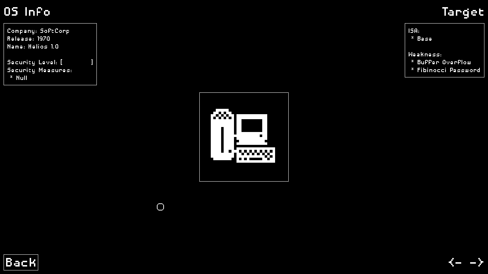

# **UNDER HEAVY DEVELOPMENT**
This game is not yet complete and is in heavy
development. You can not play it as of now.

# Disclaimer

Everything in the game is fantasy and is not related
to reality of how things work. Please keep in mind
that this game is not intended for Commerical Purposes
and is strictly against of its source code being
used for commerical purposes. See LICENSE file.

# Progventures

Open-source goodies. Here is a free game for the open
source community. Programmers aren't few but games
catered to them are so being bored to death, I decided
to make my own game. Inspired from assembly language,
I present you `Progventures`.

## Screenshots
### Main Menu

### Stage Selector

> *Font size can be adjusted.*

## Game Pitch (Advertising Description kinda thingy)
Have you been bored! Are youuuu Programmer!? You, yes
you are at the right place. Presenting to you, Progventures.

* Help your boss, He is who controls you.
  Help him break the OS to gain control. The bigger
  your control, the more abilities you unlock. The
  more you unlock, The closer to Purification.

* Go across 8 Operating System as the timeline passes.
  The later you go, the more secure it is and
  harder it gets.

## Recommended Settings

* For 720p monitor: set ppcm to 45
* For 1080p monitor: set ppcm to 55
* For any bigger. Just experiment yourself.

PPCM is size for default font. Its variations are
used for bigger or smaller fonts.